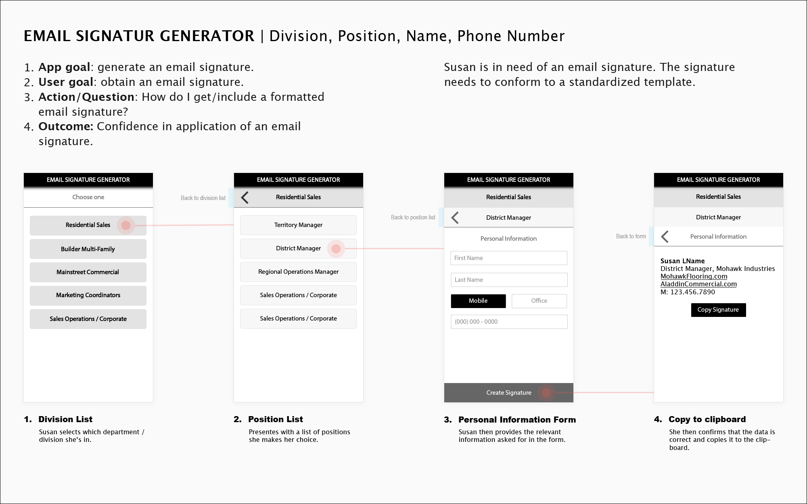

# Javascript Email Signature Gernerator App

## Concept
Create an email signature genterator for several divisions within company

## Goal:
1. Standardize Titles
2. Minimize Options
3. Actionable information from email (URLs/Phone numbers)
4. Minimal size (replies, etc.)
5. Limit spelling/formatting errors
6. Branding with website/company name in each signature
7. Custom field for title on Sales Operations/Corporate selection

Font: Calibri
Font size: 10

## UX/UI Wireframe

## Example
Select the "Sales Operations/Corporate" to create a custom title.
(https://michael-sean.com/Portfolio/javascript/email-signature-generator/)

## TODO:
1. Add selectable tabs for iPad - iPhone - Outlook.
2. Fix back arrow so that it works as expected. Clicking on the text following the back arrow returns to the previous screen.
